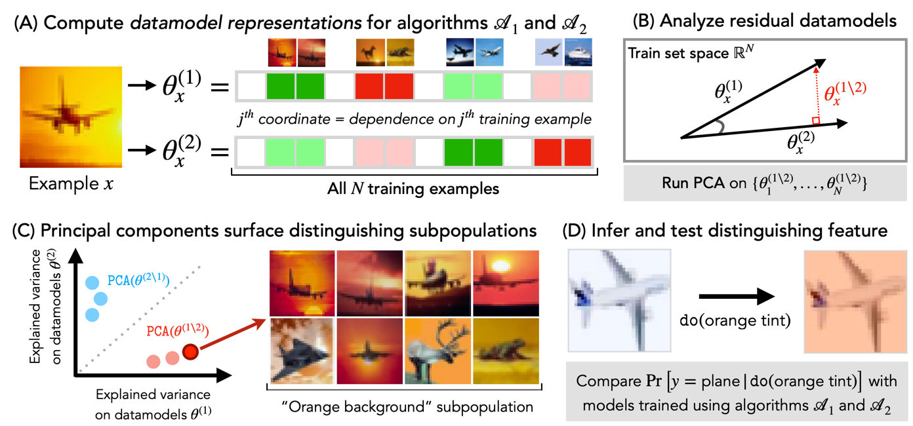
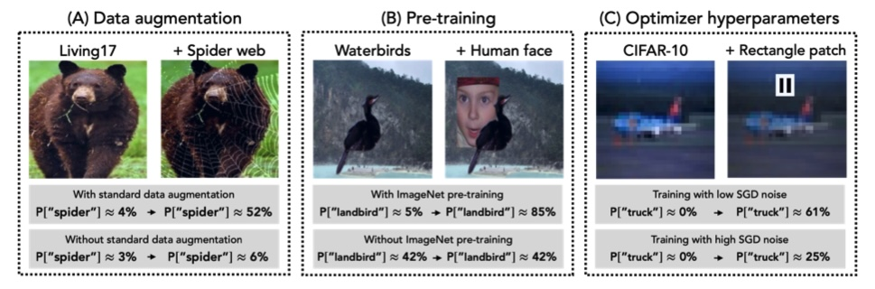

<h1>ModelDiff: A Framework for Comparing Learning Algorithms</h1>

This repository provides an API for *ModelDiff*, a framework for fine-grained comparisons of supervised learning algorithms:

**ModelDiff: A Framework for Comparing Learning Algorithms** <br>
*Harshay Shah\*, Sung Min Park\*, Andrew Ilyas\*, Aleksander Madry* <br>
**Paper**: https://arxiv.org/abs/2211.12491 <br>
**Blog post**: http://gradientscience.org/modeldiff/

```bibtex
@inproceedings{shah2023modeldiff,
  title={Modeldiff: A framework for comparing learning algorithms},
  author={Shah, Harshay and Park, Sung Min and Ilyas, Andrew and Madry, Aleksander},
  booktitle={International Conference on Machine Learning},
  pages={30646--30688},
  year={2023},
  organization={PMLR}
}
```

## Overview
<p align='center'></p>

The figure above summarizes *ModelDiff*, our algorithm comparison framework.
- First, our method computes example-level data attributions (e.g., using [datamodels](https://gradientscience.org/datamodels-1/) or [TRAK](http://gradientscience.org/trak/)) for both learning algorithms (part A). In part B, we identify directions (in training set space) that are specific to each algorithm using *residual datamodels*.
- Then, we run PCA on the residual datamodels (part C) to find a set of *distinguishing training directions*---weighted combinations of training examples that disparately impact predictions of models trained with different algorithms. Each distinguishing direction surfaces a distinguishing subpopulation, from which we infer a testable *distinguishing transformation* (part D) that significantly impacts predictions of models trained with one algorithm but not the other.

In our [paper](https://arxiv.org/abs/2211.12491), we apply *ModelDiff* to three case studies that compare models trained with/without standard data augmentation, with/without ImageNet pre-training, and with different SGD hyperparameters. As shown below, in all three cases, our framework allows us to pinpoint fine-grained differences between two learning algorithms: 

<p align='center'>
        
</p>


## Example Usage

```python
from modeldiff import ModelDiff

# architecture and checkpoints of models trained with algorithms A and B
modelA = ...
modelB = ...

ckptsA = [...] 
ckptsB = [...] 

# dataloaders corresponding to train and validation set 
train_loader = ...
val_loader = ... 

# init ModelDiff 
md = ModelDiff(modelA, modelB, ckptsA, ckptsB, train_loader)

# Top-k distinguishing directions that are "important" for algorithm A but not algorithm B
diff_ab = md.get_A_minus_B(val_loader, num_pca_comps=2)

# Top-k distinguishing directions that are "important" for algorithm B but not algorithm A
diff_ba = md.get_B_minus_A(val_loader, num_pca_comps=2)
```

Check out [our notebooks](https://github.com/MadryLab/modeldiff/tree/master/analysis) for end-to-end examples of using ModelDiff to analyze how standard design choices in ML pipelines---data augmentation, ImageNet pre-training, and SGD hyperparameters---alter model predictions. 

## Getting started

1. To use the API, simply
   ```
   pip install modeldiff
   ```
   If you want to also install the dependencies to run all analysis notebooks, run
   ```
   pip install modeldiff[notebooks]
   ```
3. For an example usage, check out `notebooks/api_example.ipynb`. In there, we (a) compute TRAK scores (from scratch) for two learning algorithms and (b) then run ModelDiff to compare these algorithms (this is all achieved with one line of code using `modeldiff`!).

4. Check out [our notebooks](https://github.com/MadryLab/modeldiff/tree/master/notebooks) for end-to-end ModelDiff examples; each notebook corresponds to a case study in our [paper](https://arxiv.org/abs/2211.12491). For each case study, we provide scripts in `counterfactuals/` to test the effect of the distinguishing transformationss (inferred via ModelDiff) on the predictions of  trained using different learning algorithms. 

If you want to compute data attribution scores from scratch with a method different from TRAK (e.g. [datamodels](https://github.com/MadryLab/datamodels)), you can pre-compute those yourself and use the `.get_A_minus_B_from_scores()` and `.get_B_minus_A_from_scores()` methods:
```python
# init ModelDiff  
md = ModelDiff()

# load data attribution scores corresponding to algorithms A and B 
scoresA = ...
scoresB = ...

# Get distinguishing directions that are important for one algorithm but not the other
diff_ab = md.get_A_minus_B_from_scores(scoresA, scoresB, num_pca_comps=2)
diff_ba = md.get_A_minus_B_from_scores(scoresB, scoresA, num_pca_comps=2)
```

## Maintainers

* [Harshay Shah](https://twitter.com/harshays_)
* [Sung Min Park](https://twitter.com/smsampark)
* [Andrew Ilyas](https://twitter.com/andrew_ilyas)
* [Kristian Georgiev](https://twitter.com/kris_georgiev1)
